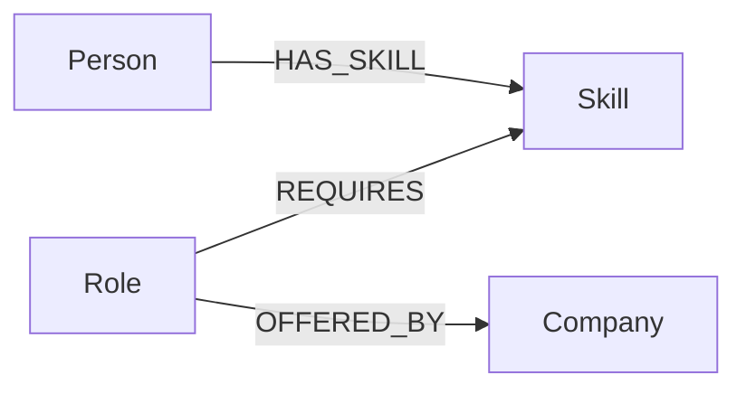

# CareerGraph

A graph-backed career exploration application for the Wexa AI CognoDB take-home assignment. CareerGraph models **people, skills, roles, and companies as connected graph entities** and uses those connections to surface career paths from a skill.

## Why a graph database?

The useful questions are relationship-heavy: *Which roles need a skill? Which people have that skill? Which companies offer those roles? Which other skills appear beside it?* A relational design can answer these questions, but each extra relationship adds joins and intermediate tables. In a graph, the core traversal is explicit and local:

`Person → HAS_SKILL → Skill ← REQUIRES ← Role → OFFERED_BY → Company`

That makes multi-hop exploration and relationship-oriented recommendations the primary operation instead of an awkward join chain.

## Data model



### Nodes

- `Person {id, name}`
- `Skill {name}`
- `Role {id, title, level}`
- `Company {id, name, industry}`

### Relationships

- `(:Person)-[:HAS_SKILL]->(:Skill)`
- `(:Role)-[:REQUIRES]->(:Skill)`
- `(:Role)-[:OFFERED_BY]->(:Company)`

## Stack

- Python 3.12
- Flask
- Official Neo4j Python driver
- CognoDB Cloud over Bolt / openCypher
- Vanilla HTML/CSS/JS frontend
- Gunicorn for production serving

## Run locally

### 1. Create CognoDB

Create a free instance at `https://console.cognodb.com/signup`. The assignment specifies a URI in the form `bolt+s://<instance-id>.databases.cognodb.cloud` and the `cognodb` password. Store credentials securely and never commit them.

### 2. Configure environment

```bash
python -m venv .venv
# macOS/Linux
source .venv/bin/activate
# Windows PowerShell
# .venv\\Scripts\\Activate.ps1

pip install -r requirements.txt
```

Copy `.env.example` to `.env` and set:

```bash
COGNODB_URI=bolt+s://<instance-id>.databases.cognodb.cloud
COGNODB_USERNAME=cognodb
COGNODB_PASSWORD=<your-generated-password>
```

### 3. Seed realistic data

```bash
python scripts/seed.py
```

The seed creates 6 people, 9 skills, 5 roles and 3 companies with typed relationships.

### 4. Start the application

```bash
python app.py
```

Open `http://localhost:5000`.

For production:

```bash
gunicorn --bind 0.0.0.0:5000 app:app
```

## Main Cypher queries

The full examples are in [`cypher/queries.cypher`](cypher/queries.cypher).

### Multi-hop traversal

The `/api/recommendations` endpoint traverses a skill to people, then to roles requiring that skill, then to companies offering those roles. It also traverses from each role to its other required skills. This is a genuine multi-hop graph exploration rather than a single lookup.

### Relationally awkward query

The final Cypher query identifies people who form a **skill bridge between two roles and their companies**. The graph expresses that pattern directly through connected nodes and relationships; a relational design would typically require several join tables and repeated self-joins.

### Parameterization

Application input is passed as Cypher parameters such as `$skill` and `$role_id`. No user input is concatenated into Cypher strings.

## API

- `GET /api/health` — database connectivity check with graceful degraded response.
- `GET /api/roles` — role/skill overview.
- `GET /api/recommendations?skill=Python` — multi-hop career recommendations.
- `GET /api/network` — sample graph traversal output.
- `GET /api/roles/<role_id>/path` — role-to-skill-to-person traversal.

## Error handling

If CognoDB is unreachable or environment variables are missing, the application remains renderable and API responses return a clear degraded/error state instead of crashing the web process.

## Deployment

`render.yaml` is included for a free Render-style deployment. Add `COGNODB_URI` and `COGNODB_PASSWORD` as deployment secrets; do not commit them.

## Assignment deliverables

- Full application source: included.
- Seed script: `scripts/seed.py`.
- Cypher queries: `cypher/queries.cypher`.
- Data model diagram: included above.
- Setup/run instructions: included above.
- Hosted demo: deploy using `render.yaml` and add the real URL before submission.
- Screen recording: record the finished live flow after deployment and database seeding.

> The repository intentionally contains no database credentials and does not fabricate a hosted-demo URL or screenshot. Those must be generated from the live CognoDB instance/deployment before final submission.
